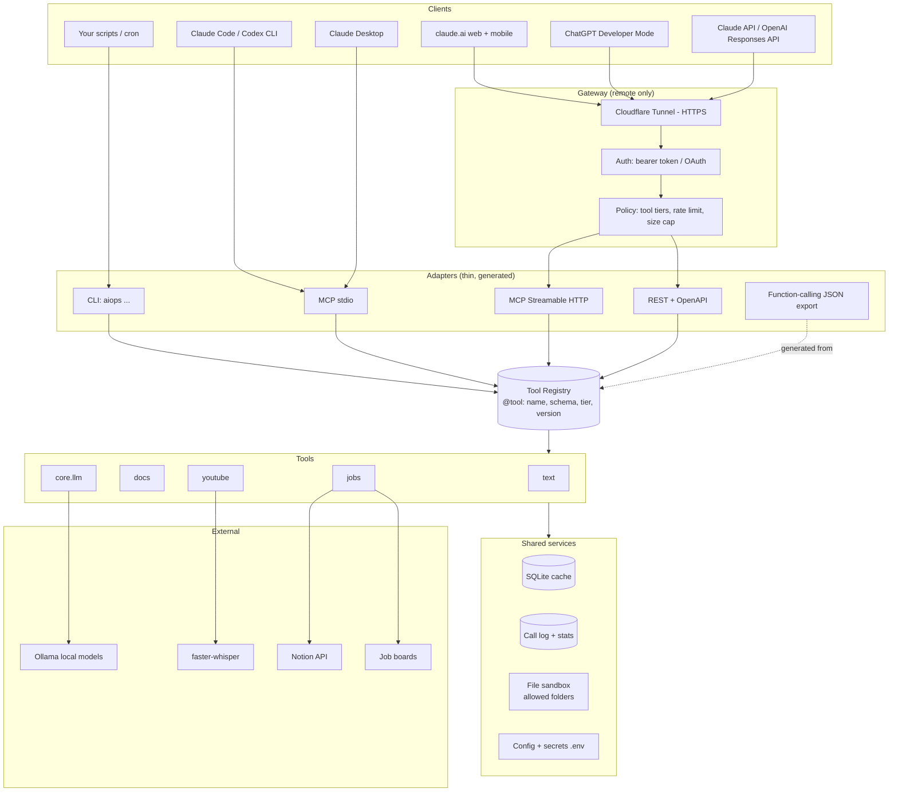
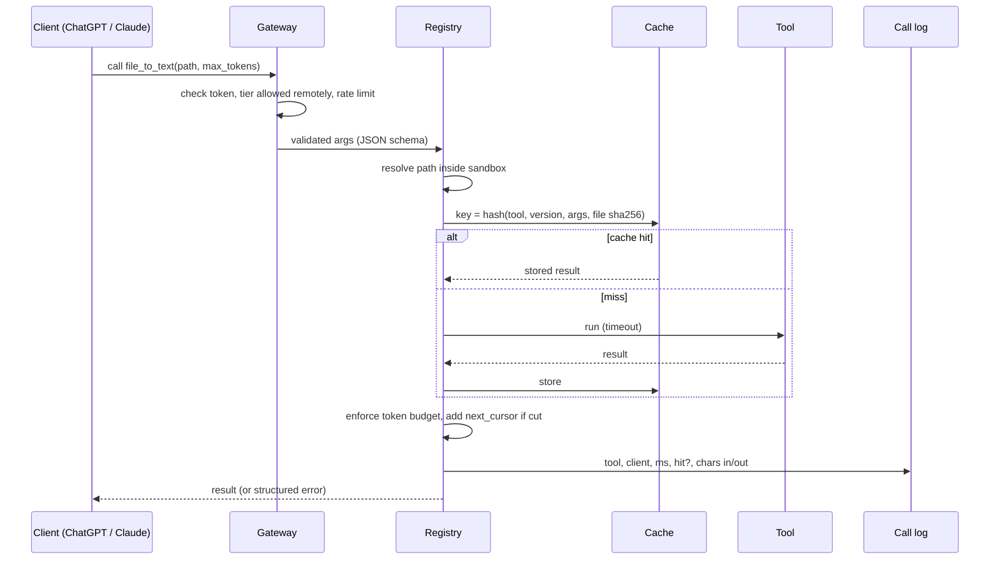

# Local AI Ops: System Design

Status: proposed (v0.3 target) · Owner: Faheem Khaskheli · Last updated: 2026-10-09

## 1. Goal

One set of deterministic Python tools that **every AI client can call**: Claude Code, Claude Desktop, claude.ai (web and phone), ChatGPT, the Claude and OpenAI APIs, Codex, and plain scripts.

The AI decides *what* to do. The tools do the mechanical work: same input, same output, almost no tokens.

## 2. Requirements

### Functional
- F1. Write a tool once; it appears automatically in the CLI, MCP (local and remote), REST/OpenAPI, and function-calling JSON.
- F2. Work with the PC on (local tools, GPU models) and with the PC off (reduced cloud fallback).
- F3. Results are trimmed to a token budget, with paging for anything larger.
- F4. Repeated calls return a cached result.
- F5. Show usage: calls, cache hits, estimated tokens saved.

### Non-functional
| Need | Target |
|---|---|
| Determinism | Same args + same tool version + same model → byte-identical output |
| Latency | Under 200 ms for rule-based tools; local LLM under 10 s |
| Cost | $0 to run; paid LLM only when the user's client is already paying |
| Privacy | Files and data stay on the PC; nothing personal in the repo |
| Security | Remote access needs a token; file access only inside allowed folders |
| Scale | One user, a few hundred calls a day; no horizontal scaling needed |

### Constraints
- Solo developer, Python only, single home PC (8–16 GB GPU or RAM).
- The PC is not always on, and the home internet has no fixed public IP.
- ChatGPT and claude.ai only reach **remote HTTPS** servers; they cannot start local programs.

## 3. High-level design



### Which door each client uses

| Client | Door | Where it runs | Needs PC on? |
|---|---|---|---|
| Claude Code, Codex CLI | MCP stdio | your PC | yes |
| Claude Desktop | MCP stdio (config file) | your PC | yes |
| claude.ai web + mobile | MCP HTTP (custom connector) | via tunnel | yes |
| ChatGPT (Plus+) | MCP HTTP (Developer Mode connector) | via tunnel | yes |
| Custom GPT | REST + OpenAPI (Actions) | via tunnel | yes |
| Claude API / OpenAI API | remote MCP tool, or function calling in your own code | via tunnel or in-process | depends |
| claude.ai with PC off | Claude Skill: `pip install` from GitHub in Claude's sandbox | Anthropic sandbox | **no** |
| Scripts, cron | CLI or `import aiops` | your PC | yes |

## 4. Deep dive

### 4.1 Tool Registry (the core idea)

Today, `cli.py` and `mcp_server.py` each describe the tools separately. That will drift. Instead, every tool is declared **once**:

```python
from aiops.registry import tool

@tool(
    name="file_to_text",
    tier="read",            # read | write | llm | admin
    version=1,              # bump when output format changes -> cache invalidates
    remote=True,            # allowed over HTTP?
    max_tokens=4000,        # default output budget
)
def file_to_text(path: str, max_tokens: int = 4000) -> str:
    """Read PDF/DOCX/HTML/CSV/JSON as compact text."""
```

The registry reads the function's type hints and docstring and generates:
- the argparse command (`aiops docs totext`),
- the MCP tool definition (stdio and HTTP),
- the FastAPI route and OpenAPI schema,
- `aiops export openai-tools` and `aiops export anthropic-tools` JSON for function calling.

Adapters contain no business logic. Adding a tool = one function + one test.

### 4.2 Call pipeline (every call, every door)



### 4.3 Determinism rules
1. Rule-based tools: no randomness, no wall-clock in output, stable sorting, explicit tie-breaks.
2. LLM tools: `temperature 0`, `top_k 1`, fixed `seed`, JSON schema output, and the model **pinned by digest** (`ollama show --modelfile`). The digest goes into the cache key.
3. Cache key = `sha256(tool name, tool version, normalized args, content hash of input files, model digest)`.
4. Golden tests: fixed inputs in `tests/golden/` with stored expected outputs; CI fails if any output changes without a version bump.

### 4.4 Caching
- One SQLite file (`~/.cache/aiops/cache.db`), one namespace per tool.
- Keyed by **file content hash**, not path, so an edited file is recomputed automatically.
- TTL only for live data (job boards: 24 h; Notion reads: 1 h). Everything else never expires; bumping `version` invalidates.
- `aiops cache clear [ns]` and `aiops cache stats`.

### 4.5 Token budget and paging
- Every text result is cut by `trim_to_tokens` at a paragraph boundary.
- If cut, the response includes `next_cursor`; the client calls again with `cursor=` to read on. The AI reads only what it needs.
- Hard server cap (e.g. 8,000 tokens) even if the client asks for more.

### 4.6 Errors
Structured, so the AI can recover without guessing:
```json
{"error": {"code": "OLLAMA_DOWN", "message": "Local model not reachable", "hint": "Start Ollama or use a non-LLM tool"}}
```
- Timeouts per tier: read 30 s, llm 120 s, youtube transcribe runs as a background job (`job_id`, poll with `job_status`).
- **No silent fallback to paid models.** If Ollama is down, the tool fails clearly.
- Retries only for network calls (Notion, job boards): 3 tries, exponential backoff.

### 4.7 Security
| Risk | Control |
|---|---|
| Stranger finds the tunnel URL | Bearer token (ChatGPT "Token" auth), or Cloudflare Access / OAuth for claude.ai; token in `.env` |
| AI reads files it shouldn't | File sandbox: only paths under `AIOPS_ALLOWED_DIRS`; reject `..` and symlinks out |
| Prompt injection in a document makes the AI call write tools | Remote default allows `read` + `llm` tiers only; `write` tools (Notion sync) are local-only or need client approval |
| Leaking secrets | Secrets only in `.env`, never in tool output; output scrubbed for `sk-`, `ntn_`, `secret_` patterns |
| Abuse / runaway loops | 60 calls/min per token; max output size; per-call timeout |

### 4.8 Observability
- Call log table: time, client, tool, ms, cache hit, chars in/out.
- `aiops stats`: calls per tool, hit rate, and **estimated tokens saved** (input chars avoided ÷ 4).
- Use it to decide which repeated chat tasks to turn into tools next.

## 5. Deployment modes

| Mode | Setup | Reaches | Cost |
|---|---|---|---|
| **A. Local** | `aiops mcp` (stdio) | Claude Code, Claude Desktop, Codex, scripts | $0 |
| **B. Home server** | `aiops serve --http :8000` + Cloudflare Tunnel (`cloudflared`) as a startup service | All of A + ChatGPT, claude.ai, phone, APIs | $0 (free tunnel, needs a domain for a fixed URL) |
| **C. Always-on fallback** | Same container on a small VPS, `AIOPS_PROFILE=cloud` (no GPU tools, no personal files) | text/docs tools when PC is off | ~$4–6/month |
| **D. Skill** | `SKILL.md`: install from GitHub, run CLI in Claude's sandbox | claude.ai with PC off | $0 |

Start with **A + B + D**. Add C only if PC-off usage turns out to matter.

## 6. Target repo layout

```
aiops/
  registry.py        # @tool, schema generation, budget, cache, logging
  adapters/
    cli.py           # generated argparse
    mcp.py           # stdio + streamable HTTP
    rest.py          # FastAPI + OpenAPI (Custom GPT Actions)
    export.py        # OpenAI / Anthropic function-calling JSON
  gateway/
    auth.py          # bearer token, rate limit
    sandbox.py       # allowed folders
  core/ text/ docs/ youtube/ jobs/   # tools (unchanged logic)
skills/aiops/SKILL.md
deploy/
  cloudflared.yml
  aiops.service      # systemd / Windows Task Scheduler notes
  Dockerfile
tests/ tests/golden/
```

## 7. Trade-offs

| Decision | Chosen | Alternative | Why |
|---|---|---|---|
| Protocol | MCP first, REST second | REST only | MCP is native in Claude and ChatGPT; REST kept for Custom GPTs |
| Exposure | Cloudflare Tunnel | ngrok, port forwarding, VPS | Free, fixed URL, no open ports, works without public IP |
| Where it runs | Home PC | Cloud | Free GPU, private files; cost: down when PC is off |
| Cache | SQLite | Redis | Zero setup, one file, plenty for one user |
| Tool definitions | Registry + generated adapters | Hand-written per adapter | One source of truth; small upfront cost |
| Remote write tools | Off by default | On | Prompt injection risk outweighs convenience |
| LLM fallback | Fail loudly | Auto-switch to paid API | Keeps cost and determinism predictable |

## 8. Roadmap

1. **v0.3 (registry):** `registry.py`, move existing tools onto `@tool`, golden tests, `aiops stats`.
2. **v0.4 (remote):** HTTP MCP + bearer auth + sandbox + Cloudflare Tunnel guide → ChatGPT and claude.ai connected.
3. **v0.5 (reach):** REST/OpenAPI for Custom GPTs, function-calling export, `SKILL.md`.
4. **v0.6 (more tools):** chosen from `aiops stats` and the chats you repeat most.

## 9. What to revisit as it grows
- Multi-user (sharing with others): per-user tokens, OAuth, separate caches.
- Many tools (50+): clients slow down with big tool lists; group tools or expose a single `run_tool(name, args)` plus `search_tools(query)`.
- Long jobs (transcription, batch scoring): move to a proper job queue if they pile up.
- If the VPS fallback gets heavy use, consider moving non-private tools there permanently.
